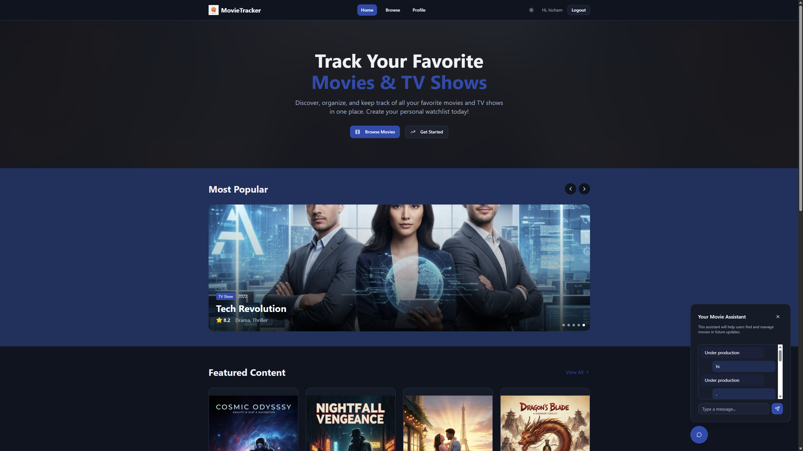
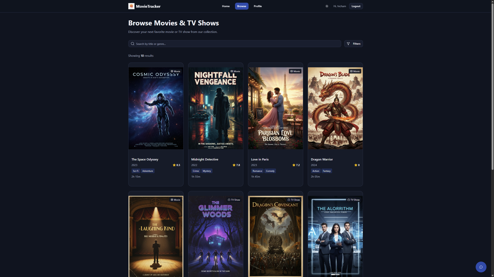
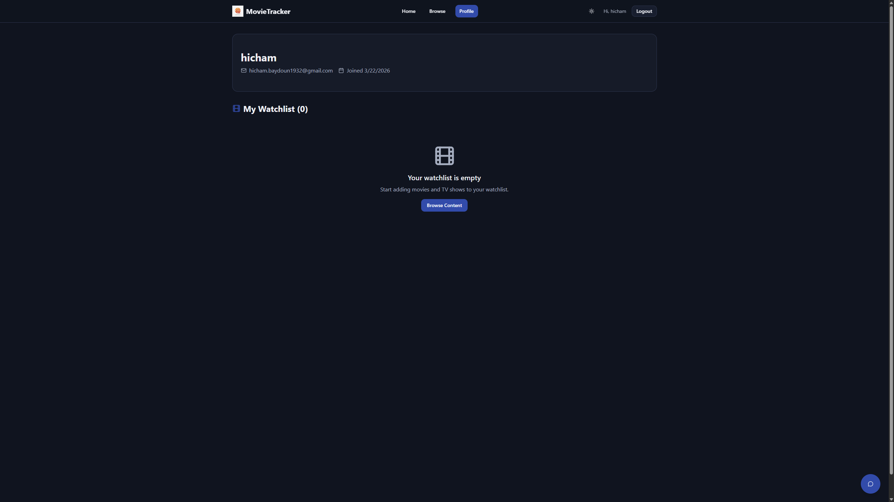
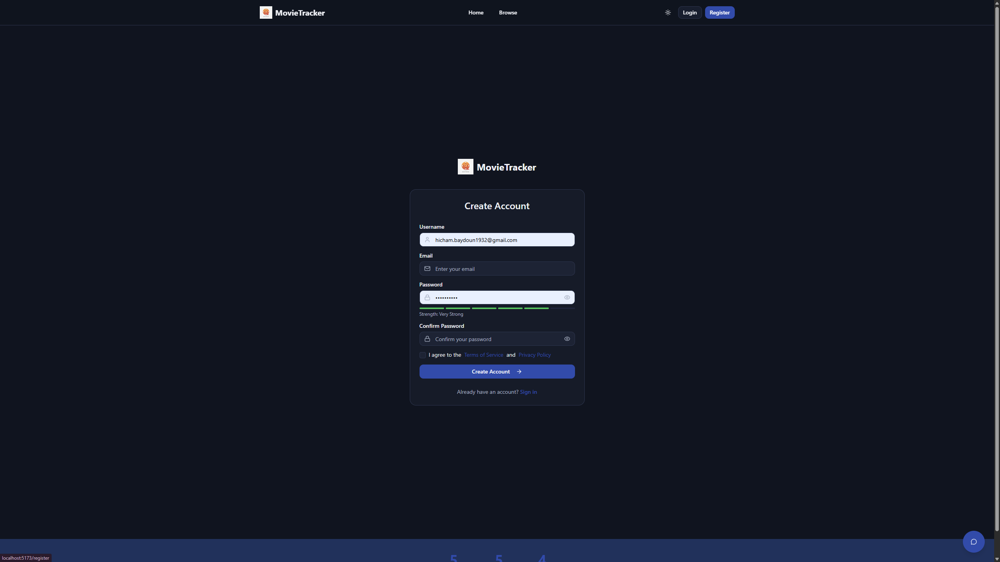
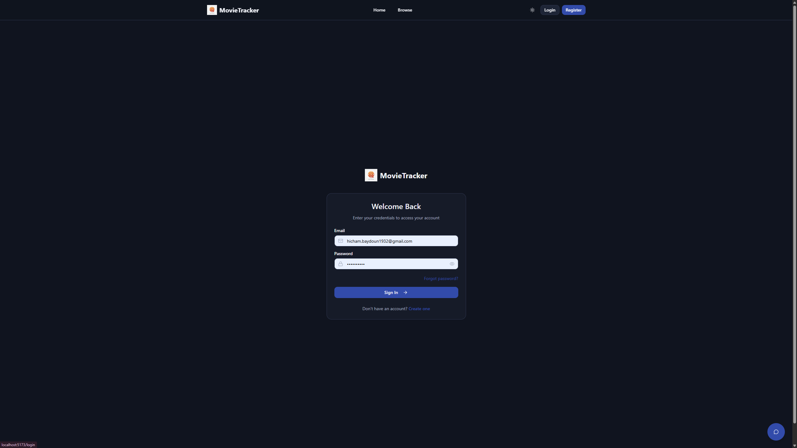

# Code Weavers - Movie and TV Show Tracker (Phase 1)

Frontend application for CSC443 built with React, TypeScript, Vite, and Tailwind CSS.

## Project Title and Team Member Names

- **Project Title:** Movie and TV Show Tracker
- **Team Name:** Code Weavers
- **Course:** CSC443 - Spring 2026
- **Team Member 1:** Hicham Baydoun
- **Team Member 2:** Nour Al Housa Al Omari
- **Team Member 3:** Kassem Nader
- **Team Member 4:** Dana Tello

## Assigned Topic and Primary Data Entities

- **Assigned Topic:** Build a movie and TV show tracking frontend with browsing, details, authentication views, and watchlist interactions.

Primary data entities used in the project:
- **Movie**: `id`, `title`, `year`, `genre[]`, `rating`, `duration`, `director`, `cast[]`, `synopsis`, `poster`, `type`
- **TVShow**: `id`, `title`, `year`, `genre[]`, `rating`, `seasons`, `episodes`, `creator`, `cast[]`, `synopsis`, `poster`, `type`
- **User**: `id`, `username`, `email`, `password`, `avatar`, `watchlist[]`, `joinedDate`
- **Genre**: fixed genre list used by filters and content forms
- **Watchlist**: user-specific list of saved content IDs

## Deployed Application Link

[Open the deployed app](https://t4lbo3ymybghm.ok.kimi.link)

## Frontend Setup Instructions (Local)

### Prerequisites

- Node.js `20+`
- npm `10+`

### Steps

1. Clone the repository:
   ```bash
   git clone https://github.com/Hicham-Baydoun/movie-tracker.git
   ```
2. Move into the project folder:
   ```bash
   cd app
   ```
3. Install dependencies:
   ```bash
   npm install
   ```
4. Start the frontend development server:
   ```bash
   npm run dev
   ```
5. Open the local URL shown in the terminal (default: `http://localhost:5173`).

### Useful Scripts

- `npm run dev` - start local development server
- `npm run build` - create production build in `dist/`
- `npm run preview` - preview the production build locally
- `npm run lint` - run ESLint checks

### Demo Login Credentials

```text
Email: moviebuff@example.com
Password: password123
```

## Screenshots or Demo GIF

Project screenshots (as provided) should be stored in `docs/screenshots/` using the filenames below:

- `homepage.png`
- `browse.png`
- `profile.png`
- `register.png`
- `login.png`







## Team Member Contributions (Two Primary Views Per Member)

1. **Hicham Baydoun**
   - **Add/Edit (`/add`, `/edit/:id`)**: led one of the most complex flows in the project, including dynamic movie/TV form behavior, conditional fields, strict validation, edit-mode prefill, and create/update persistence to shared mock state.
   - **Browse (`/browse`)**: implemented advanced search and multi-filter logic, active filter state management, and responsive result rendering for both movies and TV shows.
2. **Nour Al Housa Al Omari**
   - **Movie Details View (`/movies/:id`)**: implemented movie metadata display, watchlist toggle UI, and related-content section.
   - **TV Show Details View (`/shows/:id`)**: implemented seasons/episodes/creator presentation and shared details interactions.
3. **Kassem Nader**
   - **Homepage (`/`)**: implemented hero section, featured content blocks, and call-to-action layout.
   - **Profile (`/profile`)**: implemented user info panel, watchlist rendering, and remove-from-watchlist behavior.
4. **Dana Tello**
   - **Login (`/login`)**: implemented form validation, password visibility toggle, mock authentication flow, and redirect handling.
   - **Register (`/register`)**: implemented registration form UI, validation, and onboarding flow.

## How Mock Data Simulates Real Interactions

Mock data is centralized in [`src/data/mockData.ts`](src/data/mockData.ts) and used as an in-memory stand-in for backend APIs.

- **Seeded datasets**: 5 movies, 5 TV shows, 2 users, and 12 genres.
- **Shared data layer**: `AppDataContext` exposes shared `allContent`, `getContentById`, auth handlers, CRUD handlers, and watchlist handlers across pages.
- **Authentication simulation**: login checks email/password against mock users, and register creates new mock user accounts.
- **Write simulation**: add/edit form uses local state + context to create and update movies/TV shows in shared mock storage.
- **Watchlist simulation**: profile and details pages share synchronized add/remove watchlist behavior through app context.
- **Persistence layer**: all mock interactions are persisted in browser `localStorage` to simulate backend-backed user sessions and data changes.

## Project Structure

```text
src/
|-- components/
|   |-- Navbar.tsx
|-- context/
|   |-- ThemeContext.tsx
|   |-- AppDataContext.tsx
|-- data/
|   |-- mockData.ts
|-- pages/
|   |-- Homepage.tsx
|   |-- Browse.tsx
|   |-- Details.tsx
|   |-- MovieDetails.tsx
|   |-- ShowDetails.tsx
|   |-- AddEdit.tsx
|   |-- Profile.tsx
|   |-- Login.tsx
|   |-- Register.tsx
|   |-- ForgotPassword.tsx
|   |-- Terms.tsx
|   |-- Privacy.tsx
|-- App.tsx
|-- main.tsx
```

## Tech Stack

- React 19
- TypeScript 5
- Vite 7
- Tailwind CSS 3.4
- React Router 7
- shadcn/ui + Radix UI
- Lucide React

## Notes

This repository is part of an academic project for CSC443. Current implementation focuses on frontend behavior with mock data; backend integration is planned for a later phase.

### Upcoming Database Integration

In the next phase, we plan to integrate a cloud database tool such as **Firebase** so user data can be stored safely and accessed from anywhere (across devices and sessions).

### Movie Assistant (Prototype)

A bottom-right **Movie Assistant** button is included in the UI.  
For now, the chat replies with: **`Under production`**.

## Phase 1 Compliance Notes

Recent frontend updates were implemented to align with the Phase 1 project brief:

1. **Mock CRUD now updates shared app state**
   - Add/Edit operations now create and update items in shared mock data state.

2. **Register now creates mock user accounts**
   - New users are appended to the local mock user store after validation.

3. **Login, session, and profile are connected**
   - Logged-in session state is shared through app context and reflected in the profile page.

4. **Watchlist interactions are synchronized**
   - Add/remove watchlist actions are now shared across details/profile views and persisted in local storage.

5. **Two distinct detail views are routed**
   - Separate routes now exist for movie details and TV show details, with shared presentation logic.

6. **Missing linked routes were added**
   - `/forgot-password`, `/terms`, and `/privacy` pages are now available.
